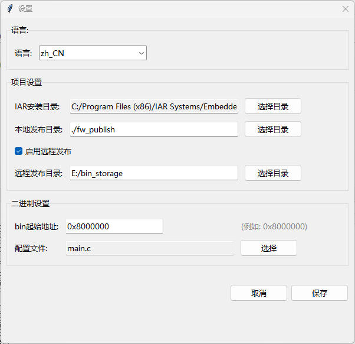
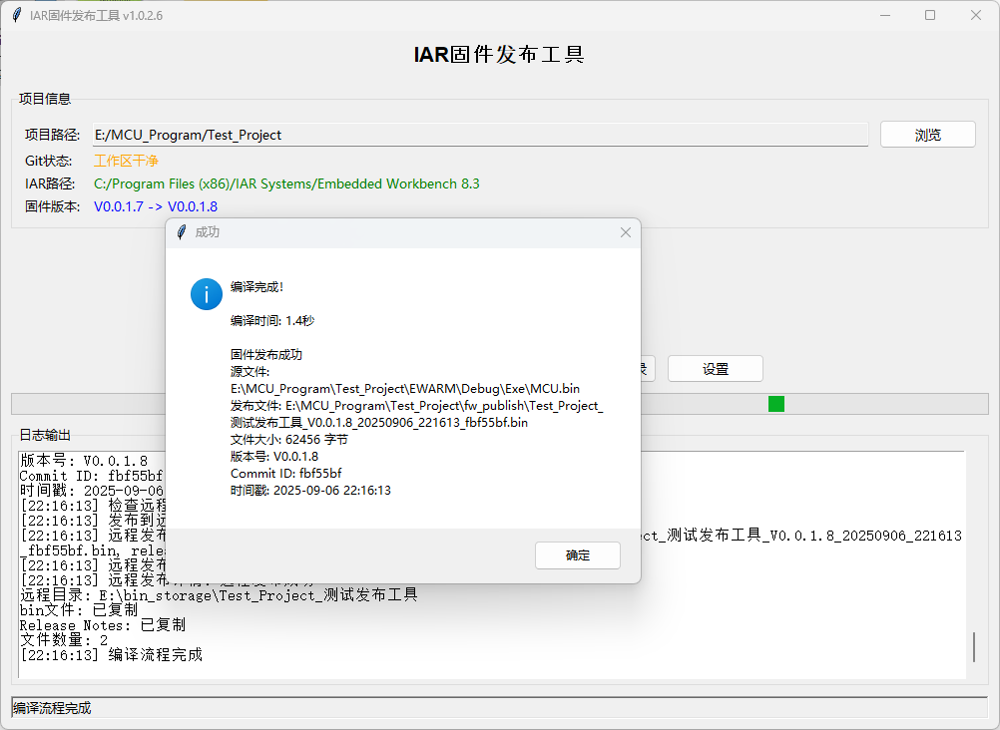

# IAR固件发布工具 / IAR Firmware Publish Tool

[](https://python.org)
[](LICENSE.md)
[](https://www.microsoft.com/windows)
[](https://www.iar.com/iar-embedded-workbench/)

一个用于IAR Embedded Workbench项目的自动化固件发布工具，支持版本管理、Git集成和二进制文件修改。

An automated firmware publishing tool for IAR Embedded Workbench projects, supporting version management, Git integration, and binary file modification.

## 界面预览 / Interface Preview

### 主界面 / Main Interface


### 设置界面 / Settings Interface


### 编译过程 / Compilation Process


### 二进制文件修改 / Binary File Modification


### 发布说明 / Release Notes


## 功能特性 / Features

- 🔧 **IAR项目编译** - 自动编译IAR Embedded Workbench项目  
  **IAR Project Compilation** - Automatically compile IAR Embedded Workbench projects
- 📦 **版本管理** - 自动递增固件版本号  
  **Version Management** - Automatically increment firmware version numbers
- 🔄 **Git集成** - 自动提交版本更改，获取commit信息，支持自定义提交信息  
  **Git Integration** - Automatically commit version changes, retrieve commit information, support custom commit messages
- 🛠️ **二进制修改** - 自动修改bin文件，注入版本和Git信息  
  **Binary Modification** - Automatically modify bin files, inject version and Git information
- 📁 **文件管理** - 自动复制和发布固件文件，支持本地和远程发布，可选择发布.out文件  
  **File Management** - Automatically copy and publish firmware files, supports local and remote publishing, optional .out file publishing
- ⚙️ **配置管理** - 用户配置持久化保存  
  **Configuration Management** - Persistent user configuration storage
- 📝 **发布说明** - 自动生成和管理Release Notes  
  **Release Notes** - Automatically generate and manage Release Notes
- 🚀 **远程发布** - 支持将固件发布到远程目录  
  **Remote Publishing** - Support publishing firmware to remote directories
- 📦 **可执行文件打包** - 支持打包为独立的exe文件  
  **Executable Packaging** - Support packaging as standalone exe files
- ⏰ **文件名时间戳** - 可选择在文件名中添加时间戳  
  **Filename Timestamp** - Optional timestamp addition to filenames
- 🌐 **多语言支持** - 支持中文、繁体中文、英文界面  
  **Multi-language Support** - Supports Chinese, Traditional Chinese, and English interfaces

## 系统要求 / System Requirements

- Windows 10/11
- Python 3.7+
- IAR Embedded Workbench 8.x
- Git

## 安装说明 / Installation

1. 克隆仓库 / Clone repository：
```bash
git clone https://github.com/yourusername/iar-firmware-publish-tool.git
cd iar-firmware-publish-tool
```

2. 创建虚拟环境 / Create virtual environment：
```bash
python -m venv venv
venv\Scripts\activate
```

3. 安装依赖 / Install dependencies：
```bash
pip install -r requirements.txt
```

4. 运行程序 / Run the program：
```bash
python main.py
```

## 使用方法 / Usage

1. **首次配置 / Initial Configuration**：
   - 点击"设置"按钮 / Click "Settings" button
   - 配置IAR安装路径 / Configure IAR installation path
   - 设置项目路径 / Set project path
   - 配置bin起始地址 / Configure bin start address
   - 选择配置文件（如main.c）/ Select configuration file (e.g., main.c)

2. **编译发布 / Compile and Publish**：
   - 点击"开始编译"按钮 / Click "Start Compilation" button
   - 工具会自动 / The tool will automatically：
     - 检查Git状态 / Check Git status
     - 递增版本号 / Increment version number
     - 弹出Git提交对话框，输入更新信息 / Pop up Git commit dialog, input update information
     - 提交版本更改 / Commit version changes
     - 编译项目 / Compile project
     - 修改二进制文件 / Modify binary files
     - 生成Release Notes / Generate Release Notes
     - 发布固件到本地目录 / Publish firmware to local directory
     - 如果启用远程发布，复制到远程目录 / If remote publishing is enabled, copy to remote directory

## 配置说明 / Configuration

### 项目设置 / Project Settings
- **IAR安装路径**：IAR Embedded Workbench安装目录  
  **IAR Installation Path**: IAR Embedded Workbench installation directory
- **项目路径**：包含.ewp文件的IAR项目目录  
  **Project Path**: IAR project directory containing .ewp files
- **本地发布目录**：最终固件文件发布目录（项目内fw_publish文件夹）  
  **Local Publish Directory**: Final firmware file publishing directory (fw_publish folder in project)
- **远程发布目录**：可选的远程固件发布目录（绝对路径）  
  **Remote Publish Directory**: Optional remote firmware publishing directory (absolute path)
- **远程发布开关**：启用/禁用远程发布功能  
  **Remote Publish Switch**: Enable/disable remote publishing feature

### 二进制设置 / Binary Settings
- **bin起始地址**：固件在Flash中的起始地址（如0x8000000）  
  **Bin Start Address**: Firmware start address in Flash (e.g., 0x8000000)
- **配置文件**：包含版本号定义的文件（如main.c）  
  **Configuration File**: File containing version number definitions (e.g., main.c)

## 版本号格式 / Version Number Format

支持格式：`V主版本.次版本.修订版本.构建版本`  
Supported format: `VMajor.Minor.Revision.Build`

示例：`V1.0.0.1` → `V1.0.0.2`  
Example: `V1.0.0.1` → `V1.0.0.2`

## 二进制文件修改 / Binary File Modification

工具会自动在bin文件中注入以下信息：  
The tool automatically injects the following information into bin files:

### 修改内容 / Modification Content
- **Git Commit ID**：当前Git提交的短哈希值（7字符）
- **文件大小** / **File Size**：bin文件的实际字节大小（4字节，小端序）
- **CRC校验值** / **CRC Checksum**：整个bin文件的CRC32校验值（4字节，小端序）
- **哈希校验值** / **Hash Checksum**：32字节的哈希校验值（包含magic number和填充）

**注意** / **Note**：固件版本号通过修改源文件后重新编译来更新，不直接修改bin文件。

### 修改位置 / Modification Locations
- **Commit ID地址** / **Commit ID Address**：通过`#pragma location`在C代码中指定的内存地址
- **文件大小地址** / **File Size Address**：Commit ID地址 + 7字节偏移
- **CRC校验地址** / **CRC Address**：文件大小地址 + 4字节偏移
- **哈希校验地址** / **Hash Address**：通过`#pragma location`在C代码中指定的内存地址

### 数据格式 / Data Format
- **Commit ID**：7字符十六进制字符串，如"a1b2c3d"
- **文件大小** / **File Size**：32位无符号整数，小端序
- **CRC校验** / **CRC**：32位无符号整数，小端序
- **哈希校验** / **Hash**：32字节数组，前4字节为magic number (0x12345678)，后28字节为填充

## 发布说明管理 / Release Notes Management

工具会自动生成和管理Release Notes：  
The tool automatically generates and manages Release Notes:
- 自动创建`RELEASE_NOTES.md`文件 / Automatically creates `RELEASE_NOTES.md` file
- 记录每次发布的版本信息 / Records version information for each release
- 智能格式化用户输入的更新信息 / Intelligently formats user-input update information
- 自动换行处理（按分号或句号分割）/ Automatic line wrapping (split by semicolons or periods)

## 远程发布功能 / Remote Publishing Feature

支持将固件发布到远程目录：  
Supports publishing firmware to remote directories:
- 可配置的远程发布目录 / Configurable remote publish directory
- 按项目名称+分支名称创建子目录 / Create subdirectories by project name + branch name
- 复制重命名后的bin文件和Release Notes / Copy renamed bin files and Release Notes
- 可选的启用/禁用开关 / Optional enable/disable switch

## 多语言支持 / Multi-language Support

- 简体中文 (zh_CN) / Simplified Chinese (zh_CN)
- 繁体中文 (zh_TW) / Traditional Chinese (zh_TW)
- English (en_US)

## 开发说明 / Development

### 项目结构 / Project Structure
```
├── main.py                 # 主程序入口 / Main program entry
├── iar_builder.py          # IAR编译模块 / IAR compilation module
├── binary_modifier.py      # 二进制文件修改模块 / Binary file modification module
├── version_manager.py      # 版本管理模块 / Version management module
├── git_manager.py          # Git操作模块 / Git operations module
├── file_manager.py         # 文件管理模块 / File management module
├── path_manager.py         # 路径管理模块 / Path management module
├── config_analyzer.py      # 配置分析模块 / Configuration analysis module
├── info_file_updater.py    # 信息文件更新模块 / info file update module
├── tool_version_manager.py # 工具版本管理模块 / Tool version management module
├── config.json            # 默认配置文件 / Default configuration file
├── user_config.json       # 用户配置文件 / User configuration file
└── requirements.txt       # Python依赖 / Python dependencies
```

### 构建可执行文件 / Build Executable

```bash
python build_exe.py
```

这将自动：  
This will automatically:
- 递增工具版本号 / Increment tool version number
- 创建PyInstaller spec文件 / Create PyInstaller spec file
- 构建可执行文件 / Build executable file
- 输出到`release/`目录 / Output to `release/` directory

生成的文件：  
Generated files:
- `IAR_Firmware_Publish_Tool.spec` - PyInstaller配置文件 / PyInstaller configuration file
- `IAR_Firmware_Publish_Tool_v{version}.exe` - 可执行文件 / Executable file

## 许可证 / License

MIT License

## 贡献 / Contributing

欢迎提交Issue和Pull Request！  
Welcome to submit Issues and Pull Requests!

## 更新日志 / Changelog

### v1.0.3.8
- 修复ICF文件解析问题，正确解析IlinkIcfFile节点中的$PROJ_DIR$宏 / Fixed ICF file parsing issue, correctly parse $PROJ_DIR$ macro in IlinkIcfFile node
- 移除path_manager.py中硬编码的默认文件名，要求必须传入参数避免个人习惯影响 / Removed hardcoded default file names in path_manager.py, require parameters to avoid personal habits affecting others
- 修复配置文件优先级问题，确保用户界面指定的项目路径优先于user_config.json中的设置 / Fixed configuration priority issue, ensure UI-specified project path takes precedence over user_config.json settings
- 确保所有配置文件路径都使用相对路径，与主程序文件在同一目录 / Ensure all configuration file paths use relative paths, same directory as main program file
- 移除os.getcwd()的使用，避免打包exe时的工作目录问题 / Removed os.getcwd() usage to avoid working directory issues when packaging exe
- 优化代码结构，移除重复的配置文件 / Optimized code structure, removed duplicate configuration files
- 改进错误处理，项目路径无效时直接报错而不是使用当前工作目录 / Improved error handling, directly report error when project path is invalid instead of using current working directory

### v1.0.3.7
- 修复IAR编译命令路径错误，使用正确的ewp文件路径而不是项目根目录 / Fixed IAR compilation command path error, use correct .ewp file path instead of project root directory
- 修复bin文件查找逻辑，严格匹配ewp文件名对应的bin文件，避免选择错误的备份文件 / Fixed bin file finding logic, strictly match .ewp filename corresponding bin file, avoid selecting wrong backup files
- 修复exe运行时配置文件路径问题，使用绝对路径确保配置文件正确加载 / Fixed exe runtime configuration file path issue, use absolute paths to ensure configuration files are loaded correctly
- 修复项目路径和ewp文件路径混淆问题，确保路径变量正确分离 / Fixed project path and .ewp file path confusion issue, ensure path variables are correctly separated
- 修复配置文件选择对话框文件类型筛选，添加对C++文件(.cpp, .cc, .cxx, .hpp, .hxx)的支持 / Fixed configuration file selection dialog file type filter, added support for C++ files (.cpp, .cc, .cxx, .hpp, .hxx)
- 改进编译命令构建逻辑，确保IAR编译器能正确识别项目文件 / Improved compilation command building logic, ensure IAR compiler can correctly identify project files
- 改进bin文件查找策略，移除"查找最新文件"逻辑，采用严格文件名匹配 / Improved bin file finding strategy, removed "find latest file" logic, adopted strict filename matching
- 移除备份spec文件功能，简化PyInstaller构建过程 / Removed backup spec file functionality, simplified PyInstaller build process

### v1.0.3.6
- 添加.out文件发布功能，支持同时发布.bin和.out文件到本地和远程目录 / Added .out file publishing feature, support publishing both .bin and .out files to local and remote directories
- 优化设置页面布局，调整复选框间距和对齐方式 / Optimized settings page layout, adjusted checkbox spacing and alignment

### v1.0.3.5
- 添加文件名时间戳控制选项，用户可选择是否在文件名中添加时间戳 / Added filename timestamp control option, users can choose whether to add timestamp to filename
- 优化设置页面布局，将相关复选框放在同一行以节省空间 / Optimized settings page layout, place related checkboxes on the same row to save space

### v1.0.3.4
- 添加哈希校验和功能，支持__hash_value变量 / Added hash checksum functionality, support for __hash_value variable
- 添加Flash起始地址显示，在主界面显示当前配置的Flash起始地址 / Added Flash start address display on main interface
- 优化主界面布局，调整信息显示顺序：IAR路径、Flash起始地址、Git状态、固件版本 / Optimized main interface layout, adjusted information display order
- 修复打包exe时出现的权限错误 / Fixed permission errors when running packaged exe
- 改进IAR路径查找逻辑，确保始终返回有效的exe文件路径 / Improved IAR path finding logic, ensure always returns valid exe file path

### v1.0.3.0
- 修复语言设置持久化问题 / Fixed language setting persistence issue
- 改进配置加载机制 / Improved configuration loading mechanism
- 优化用户界面体验 / Optimized user interface experience

## 联系方式 / Contact

如有问题，请提交Issue或联系开发者。  
If you have any questions, please submit an Issue or contact the developer.